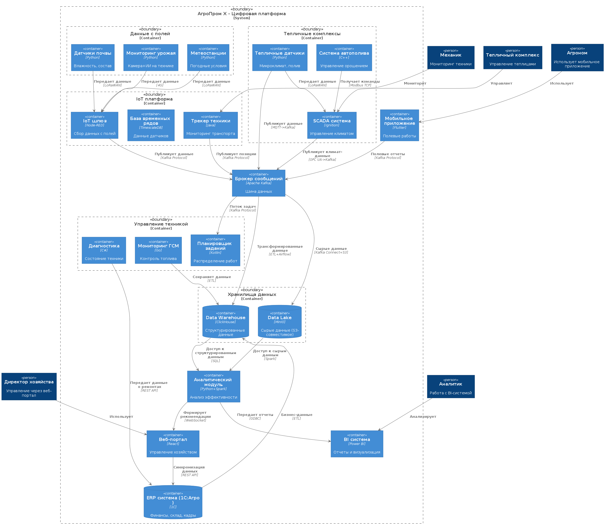

# MSA-AgroTech

## О компании

Микросервисная архитектура способна решать специфические задачи и в аграрной сфере (AgTech): от точного земледелия и управления техникой до отслеживания цепочек поставок и анализа данных.

Компания «АгроТех Х» давно работает на рынке, занимается выращиванием различных культур, имеет 150 тепличных комплексов по всей стране и занимается свиноводством. У компании есть свой собственный парк техники.

IT-ландшафт компании формировался постепенно, и там можно встретить как достаточно современные, так и совсем устаревшие технологии, от которых постепенно отказываются.

По мере развития IoT компания пробует различные датчики и системы в своей работе. Например, для парка техники внедрён мониторинг местоположения, состояния, расхода топлива, выполнения работ множества единиц техники (тракторы, комбайны, опрыскиватели) разных производителей для планирования заданий, сокращения издержек и повышения производительности.

Сейчас перед компанией стоит задача — повысить эффективность в сфере животноводства и по максимуму автоматизировать процессы, связанные с кормлением, безопасностью и мониторингом поголовья скота.

На рынке уже представлены продукты из этой сферы: это PigVision, ALUS или PigTales, есть различные исследования и проекты: https://blog.iotcloudplatform.com/how-to-design-an-iot-smart-pig-farming-system/ . Но купить и адаптировать их в настоящих реалиях не получится либо из-за ограничений в законодательстве, либо из-за дороговизны реализации. Например, использование дронов для мониторинга скота.

Поэтому решено сделать MVP архитектуры c нуля и запустить как отдельную платформу для мониторинга скота. Сначала планируется реализовать это на ограниченном количестве ферм, а затем потенциально предлагать как SaaS-решение для других компаний — это уже выходит за рамки проектной работы.

### Функциональные требования к системе

Система должна:

  - фиксировать признаки беспокойного поведения или драк среди животных и оповещать оператора;
  - фиксировать признаки задавливания поросят;
  - управлять кормушками и поилками разных производителей;
  - оценивать состояние животных по внешнему виду и поведению: болезнь, гибель, беспокойство и так далее;
  - следить за состоянием систем фильтрации воды;
  - пересчитывать поголовье;
  - следить за запасами еды и прогнозировать расход;
  - делать пересчёт животных;
  - поддерживать необходимое количество видеокамер для аналитики в реальном времени от разных производителей;
  - быть построена по принципу «центральный сервер — агенты» на конкретных фермах без ограничения количества таких агентов (в синхронизации между агентами и центральным сервером допускается задержка до 10 минут без учёта проблем со связью);
  - предоставлять базовые метрики для передачи в другие системы;
  - поддерживать возможность добавления собственных метрик;
  - работать даже в случае отсутствия интернета и при необходимости отправлять уведомления дежурному сотруднику на местах мониторинга, а после восстановления связи синхронизироваться с центральной системой;
  - иметь разделение ролей и поддерживать современные способы аутентификации и авторизации;
  - иметь API для создания мобильного приложения или веб-приложения.

### Нефункциональные требования

Система должна:

  - обеспечивать достаточно высокую отказоустойчивость 99,95%;
  -  быть расширяемой, то есть иметь возможность разработать новый функционал без изменений существующего;
  -  иметь высокую производительность — от момента возникновения нештатной ситуации, зафиксированной с помощью видеоаналитики, должно проходить не более 5 секунд до момента оповещения;
  -  позволять системе видеоаналитики реагировать в реальном времени (миллисекунды).

#### Что нужно учесть

Нейронные сети:

  - Часто нейронные сети путают тень животного с самим животным — для MVP не критично.
  - Проблемы с освещением — камеры должны уметь снимать и в ночное время суток.
  - Трекинг животных достаточно сложен, так как особи очень похожи.
  - Готовую нейросетевую модель предоставят партнёры.

Инфраструктура:

  - На ферме нестабильный WiFi, поэтому нужно продумать альтернативные каналы связи.
  - Покрытие камерами всей площади — нужно по максимуму убрать слепые зоны либо воспользоваться камерами типа «рыбий глаз», но это снизит качество в силу выпуклости линзы.
  - На каждой ферме допустимо использовать один центральный сервер и необходимый набор edge-устройств.

Архитектура компании «АгроТех Х»

### Цели бизнеса

Собрать MVP для мониторинга свиноводческих ферм, который работает в соответствии с указанными требованиями на нескольких фермах.
