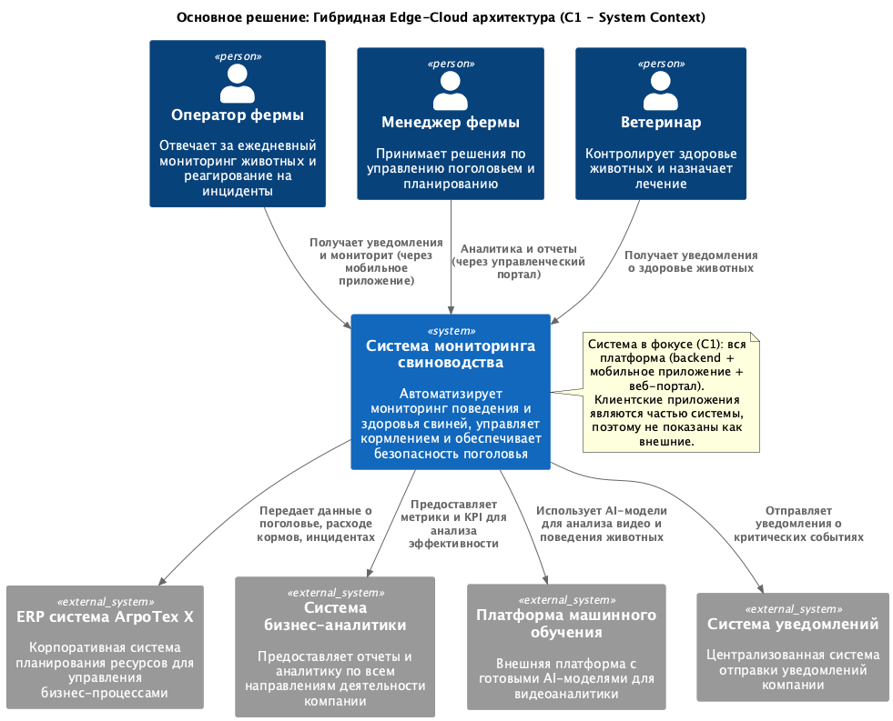
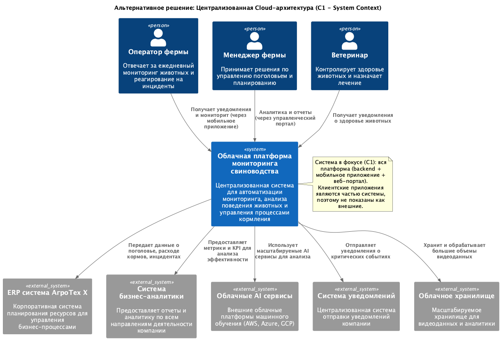

### Название задачи:
Разработка MVP системы мониторинга свиноводческих ферм

### Автор:

Rinat Muhamedgaliev

### Дата:
12.08.2025

### Функциональные требования

| № | Действующие лица или системы | Сценарий | Описание |
|:-:|:--|:--|:--|
| 1 | Оператор фермы | Мониторинг поведения животных | Система автоматически анализирует видео с камер, выявляет беспокойное поведение, драки, задавливание поросят и немедленно уведомляет оператора |
| 2 | Система видеоаналитики | Оценка состояния животных | ИИ анализирует внешний вид и поведение животных, определяет признаки болезни, гибели, стресса и передает данные в систему |
| 3 | Контроллеры оборудования | Управление кормлением и поением | Автоматическое управление кормушками и поилками разных производителей на основе данных о поголовье и расписании |
| 4 | Система учета | Подсчет поголовья | Автоматический пересчет количества животных с помощью видеоаналитики с периодичностью в реальном времени |
| 5 | Система снабжения | Мониторинг запасов корма | Отслеживание текущих запасов еды, прогнозирование расхода на основе данных о поголовье и потреблении |
| 6 | Техническая служба | Контроль систем фильтрации | Мониторинг состояния систем фильтрации воды через датчики, уведомления о неисправностях |
| 7 | Центральный сервер | Синхронизация данных | Сбор и агрегация данных с агентов на фермах с допустимой задержкой до 10 минут |
| 8 | Внешние системы | Получение метрик | Экспорт базовых и кастомных метрик в ERP и BI системы компании |
| 9 | Дежурный сотрудник | Локальные уведомления | Получение уведомлений на месте при отсутствии интернета, работа в автономном режиме |

### Нефункциональные требования

| № | Требование |
|:-:|:--|
| 1 | Отказоустойчивость 99,95% (не более 4,38 часов простоя в год) |
| 2 | Расширяемость - возможность добавления нового функционала без изменения существующего кода |
| 3 | Производительность - не более 5 секунд от обнаружения нештатной ситуации до оповещения оператора |
| 4 | Реакция системы видеоаналитики в реальном времени (миллисекунды) для критических событий |
| 5 | Автономная работа в условиях отсутствия интернета с локальным сохранением данных |
| 6 | Поддержка видеокамер разных производителей без привязки к конкретному бренду |
| 7 | Современная система аутентификации и авторизации с разделением ролей пользователей |
| 8 | Масштабируемость - поддержка неограниченного количества агентов на фермах |
| 9 | API для интеграции с мобильными и веб-приложениями |
| 10 | Синхронизация между агентами и центральным сервером с задержкой до 10 минут |

### Решение

**Основное решение: Гибридная Edge-Cloud архитектура**

Контекстная диаграмма основного решения представлена в файле [solution1_context_diagram.puml](solution1_context_diagram.puml).

> Границы системы в фокусе (C1): вся платформа мониторинга (backend + мобильное приложение + веб-портал). Клиентские приложения являются частью системы и не отображаются как внешние системы; пользователи взаимодействуют с системой через эти клиентские интерфейсы.

**Архитектурные принципы:**

1. **Центр и агенты**: на каждой ферме есть локальный агент, который выполняет критичные операции автономно.

2. **Локальная обработка**: видеоаналитика и управление выполняются на месте, поэтому система реагирует очень быстро.

3. **Автономность**: при отсутствии связи агенты продолжают работать, данные сохраняются локально.

4. **Микросервисы**: отдельные сервисы для видеоаналитики, кормления, мониторинга оборудования.

**Почему так:**

- **< 5 секунд**: локальная обработка исключает сетевые задержки
- **Автономность**: важна для ферм, где интернет нестабилен
- **Надёжность 99,95%**: достигается распределением функций
- **Расширяемость**: микросервисы проще дополнять

**Интеграция с существующими системами:**
- Использование существующей ERP системы 1С:Агро для учета поголовья
- Подключение к корпоративной BI системе для аналитики и отчетности
- Интеграция с системой уведомлений компании

### Альтернативы

**Альтернативное решение: Централизованная Cloud-архитектура**

Контекстная диаграмма альтернативного решения представлена в файле [solution2_context_diagram.puml](solution2_context_diagram.puml).

> Границы системы в фокусе (C1) аналогично: вся платформа (backend + мобильное приложение + веб-портал). Клиентские приложения рассматриваются как часть системы, взаимодействия пользователей на диаграмме идут напрямую к системе с пометкой, что выполняются через соответствующие интерфейсы.

**Принципы альтернативного решения:**

1. **Полная централизация**: Вся обработка данных происходит в облачной платформе
2. **Простые edge-шлюзы**: На фермах только устройства для сбора и передачи данных
3. **Облачные AI-сервисы**: Использование готовых решений AWS/Azure/GCP для масштабируемости
4. **Стандартизация**: Унифицированный подход для всех ферм компании

**Сравнение решений:**

| Критерий | Основное решение | Альтернативное решение |
|:--|:--|:--|
| Время реакции | Миллисекунды (локально) | Секунды (через интернет) |
| Автономность | Полная | Отсутствует |
| Сложность развертывания | Высокая | Низкая |
| Начальные затраты | Высокие | Низкие |
| Операционные расходы | Низкие | Высокие |
| Зависимость от сети | Минимальная | Критическая |
| Масштабируемость | Ограниченная | Высокая |

**Почему выбрали и как внедряем:**
Гибрид — целевое состояние: только он гарантирует нужную скорость реакции (<5 сек) и работу без интернета. Для MVP начинаем с централизованного облака (быстрее старт), затем переходим к гибриду по этапам. Подробности плана перехода будут описаны отдельно.

### Недостатки, ограничения, риски

**Недостатки основного решения:**

1. **Высокая сложность разработки**: Необходимо создать и поддерживать распределенную систему с множественными агентами
2. **Значительные первоначальные инвестиции**: Требуется мощное оборудование на каждой ферме
3. **Сложность обновлений**: Развертывание обновлений на множестве агентов требует специальных механизмов
4. **Необходимость квалифицированного персонала**: На каждой ферме нужны специалисты для обслуживания сложного оборудования

**Ограничения:**

1. **Вычислительные ресурсы edge-устройств**: Ограниченная производительность может сдерживать развитие AI-алгоритмов
2. **Сложность диагностики**: Проблемы в распределенной системе сложнее выявлять и устранять
3. **Ограничения по сети**: При плохом интернете синхронизация может занимать больше 10 минут
4. **Версионирование**: Сложность поддержания совместимости между версиями агентов и центрального сервера

**Риски:**

1. **Риск отказа локального агента**: Выход из строя агента может парализовать работу целой фермы
    - *Митигация*: Резервирование критических компонентов, быстрая замена оборудования

2. **Рассинхронизация данных**: возможны расхождения между агентами и центром
    - *Как решаем*: правила разрешения конфликтов, постепенная согласованность данных

3. **Сложность масштабирования**: При росте числа ферм усложняется управление инфраструктурой
    - *Митигация*: Автоматизация развертывания, Infrastructure as Code

4. **Безопасность edge-устройств**: Агенты на фермах могут быть более уязвимы для атак
    - *Митигация*: VPN, шифрование, регулярные обновления безопасности

5. **Vendor lock-in**: Зависимость от конкретных производителей оборудования
    - *Митигация*: Стандартизированные интерфейсы, поддержка множественных производителей

6. **Технологическое устаревание**: Edge-устройства сложнее обновлять
    - *Митигация*: Модульная архитектура, планирование жизненного цикла оборудования