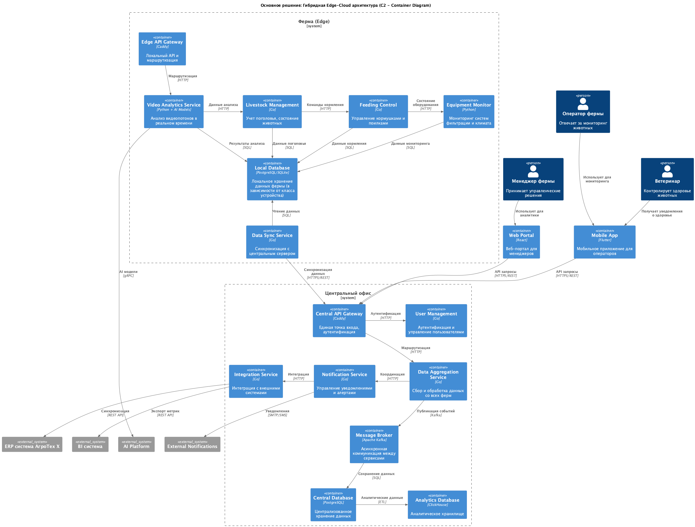
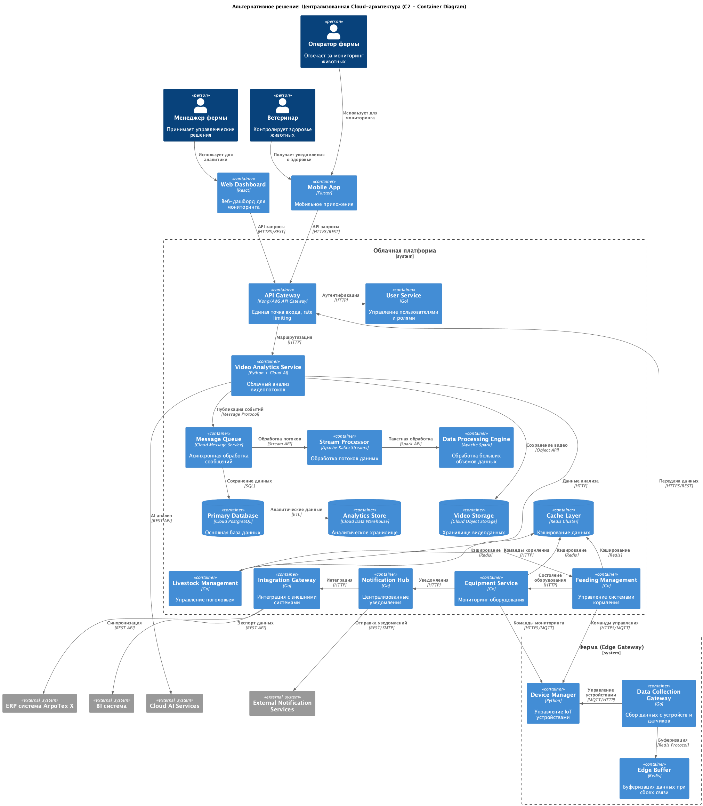

### Название задачи:
Высокоуровневое видение архитектуры системы мониторинга свиноводческих ферм на уровне контейнеров (C2)

### Автор:
Rinat Muhamedgaliev

### Дата:
12.08.2025

### Ограниченные контексты

Система разделена на следующие области ответственности:

| № | Контекст | Ответственность | Обоснование |
|:-:|:--|:--|:--|
| 1 | **Video Analytics** | Анализ видеопотоков, обнаружение инцидентов, оценка поведения животных | Изолированная область знаний с собственными алгоритмами ИИ |
| 2 | **Livestock Management** | Учет поголовья, состояние животных, ветеринарные данные | Бизнес-домен управления животными |
| 3 | **Feeding Control** | Управление кормушками и поилками, расчет рационов | Автономная система управления питанием |
| 4 | **Equipment Monitoring** | Мониторинг систем фильтрации, климат-контроля, технического состояния | Контроль инженерных систем фермы |
| 5 | **Notification & Alerting** | Обработка уведомлений, эскалация инцидентов, коммуникации | Централизованная система оповещений |
| 6 | **Data Integration** | Синхронизация данных, интеграция с внешними системами | Интеграционный слой с корпоративными системами |
| 7 | **User Management** | Аутентификация, авторизация, управление ролями | Общий контекст безопасности |

### Решение основной архитектуры

**Основное решение: Гибридная Edge-Cloud архитектура (C2 уровень)**

Контейнерная диаграмма основного решения представлена в файле  [solution1_container_diagram.puml](./solution1_container_diagram.puml).

**Архитектурные решения по контейнерам:**

1. **Farm Agent (Edge Computing)**
    - Содержит локальные контейнеры для критичных операций
    - Обеспечивает автономную работу при отсутствии связи
    - Выполняет видеоаналитику в реальном времени

2. **Central Server**
    - Агрегирует данные со всех ферм
    - Предоставляет единый API для клиентских приложений
    - Управляет интеграцией с корпоративными системами

3. **Message Broker**
    - Обеспечивает надежную асинхронную коммуникацию
    - Гарантирует доставку критичных сообщений
    - Поддерживает различные паттерны обмена сообщениями

**Обоснование выбора технологий интеграции:**

**Очереди сообщений — Apache Kafka:**
- Преимущества:
    * Высокая пропускная способность для больших объемов данных
    * Гарантированная доставка сообщений
    * Поддержка партиционирования для масштабирования
    * Долговременное хранение событий для аудита
- Ограничения:
    * Требует больше ресурсов чем альтернативы
    * Сложность настройки и администрирования
- Компромисс: Используем Kafka для критичной коммуникации, MQTT для IoT устройств

**Альтернатива — RabbitMQ:**
- Преимущества:
    * Возможность использовать MQTT через плагин
    * Распространенная технология, простая эксплуатация
    * Невысокие требования к ресурсам
    * Поддерживает кластеризацию
- Ограничения:
    * При высоких объемах событий и долговременном хранении уступает Kafka
- Компромисс: RabbitMQ для edge/умеренной нагрузки; Kafka для высоконагруженной событийной шины

**Базы данных — PostgreSQL/SQLite (edge):**
- Преимущества:
    * ACID-совместимость для критичных данных
    * Расширенные возможности для аналитических запросов
    * Надежность и стабильность в enterprise среде
    * Для edge-устройств возможна embedded-СУБД (SQLite) для простоты, энергоэффективности и работы без сервисов
- Ограничения:
    * Вертикальное масштабирование ограничено (PostgreSQL)
    * SQLite ограничена конкурентной записью и подойдет для edge с локальными нагрузками
- Компромисс: На edge допускается SQLite; для более мощных агентов — PostgreSQL. На центральном сервере — PostgreSQL/ClickHouse. При росте нагрузки — шардинг по фермам

**API‑шлюз — Caddy:**
- Преимущества:
    * Простая декларативная конфигурация, автоматический TLS (Let's Encrypt), HTTP/2/3
    * Низкое потребление ресурсов, высокая производительность, единая точка входа и балансировка
    * Плагины/модули для OIDC, rate limiting, наблюдаемости
- Ограничения:
    * Менее богатые функции API-менеджмента «из коробки», чем у Kong (каталоги API, тонкие политики, квоты)
- Компромисс: кластеризация Caddy для отказоустойчивости; для продвинутых политик — внешние компоненты (например, OPA/casbin, отдельный rate-limit сервис) или управляемый API-шлюз в альтернативном облачном варианте

### Альтернативное решение

**Альтернативное решение: Централизованная Cloud-архитектура (C2 уровень)**

Контейнерная диаграмма альтернативного решения представлена в файле [solution2_container_diagram.puml](./solution2_container_diagram.puml).

**Архитектурные решения по контейнерам:**

1. **Cloud Platform**
    - Микросервисы развернуты в облачной инфраструктуре
    - Автоматическое масштабирование по нагрузке
    - Использование управляемых облачных сервисов

2. **Edge Gateways**
    - Простые шлюзы для сбора данных
    - Минимальная бизнес-логика
    - Буферизация данных при сбоях связи

**Обоснование выбора технологий для облачного решения:**

**Message Queue - Cloud Message Services:**
- Преимущества:
    * Управляемый сервис без администрирования
    * Автоматическое масштабирование
    * Встроенная отказоустойчивость
- Ограничения:
    * Vendor lock-in
    * Более высокая стоимость при больших объемах
- Компромисс: Используем абстракции для возможности миграции

**Database - Cloud Database Services:**
- Преимущества:
    * Автоматические бэкапы и восстановление
    * Масштабирование без простоев
    * Встроенная безопасность
- Ограничения:
    * Высокая стоимость при росте данных
    * Зависимость от облачного провайдера
- Компромисс: Гибридная модель с локальным кэшированием

### Сравнение решений

| Аспект | Основное решение | Альтернативное решение |
|:--|:--|:--|
| Автономность | Полная автономность агентов | Зависимость от облачной связи |
| Масштабируемость | Горизонтальная по фермам | Автоматическая в облаке |
| Операционные расходы | Низкие после развертывания | Растут с объемом данных |
| Время развертывания | Длительное | Быстрое |
| Сложность администрирования | Высокая | Низкая |
| Безопасность данных | Данные остаются локально | Данные в облаке |

### Недостатки, ограничения, риски

**Основное решение:**

**Недостатки:**
1. Сложность синхронизации состояния между агентами при конфликтах
2. Необходимость дублирования некоторой логики между агентами и центральным сервером
3. Сложность мониторинга и диагностики распределенной системы

**Ограничения:**
1. Ограниченная производительность локальных агентов для сложных AI-алгоритмов
2. Сложность централизованного обновления конфигураций всех агентов
3. Потребность в квалифицированном техническом персонале на каждой ферме

**Риски:**
1. **Фрагментация данных**: Различные версии данных на агентах и центральном сервере
    - Митигация: Eventual consistency, conflict resolution алгоритмы
2. **Сложность disaster recovery**: Восстановление состояния распределенной системы
    - Митигация: Регулярные снапшоты, автоматизированные процедуры восстановления
3. **Network partitioning**: Разделение сети может привести к split-brain ситуациям
    - Митигация: Консенсус алгоритмы, временные метки для разрешения конфликтов

**Альтернативное решение:**

**Недостатки:**
1. Полная зависимость от качества интернет-соединения
2. Высокие операционные расходы при росте объемов данных
3. Возможные задержки в критических операциях из-за сетевой латентности

**Ограничения:**
1. Невозможность работы при отсутствии интернета
2. Ограничения на передачу видеоданных из-за пропускной способности
3. Зависимость от SLA облачного провайдера

**Риски:**
1. **Vendor lock-in**: Критическая зависимость от облачного провайдера
    - Митигация: Использование облачно-агностичных технологий, контейнеризация
2. **Соответствие требованиям по защите данных**: Хранение данных в облаке
    - Митигация: Шифрование данных, выбор провайдера с соответствующими сертификатами
3. **Масштабирование costs**: Неконтролируемый рост расходов
    - Митигация: Мониторинг costs, автоматические лимиты, оптимизация запросов