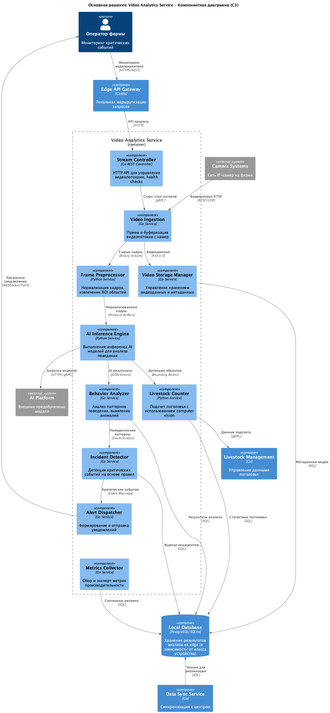
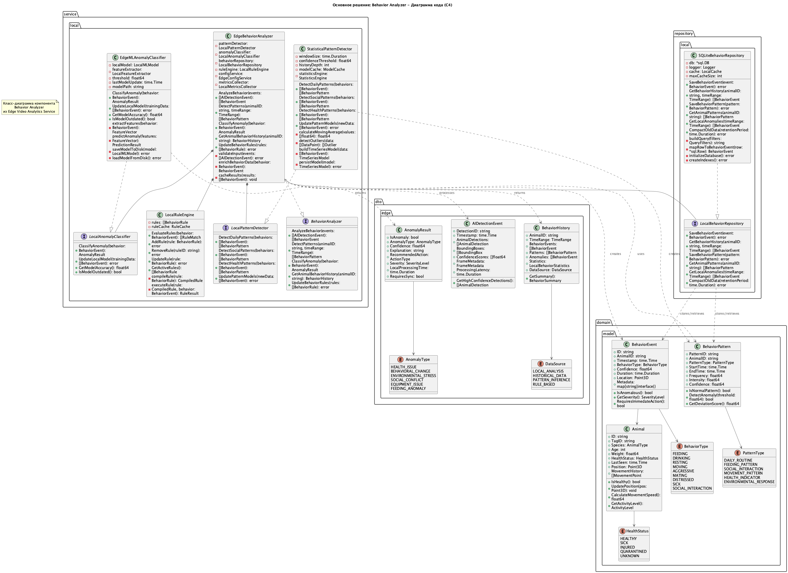
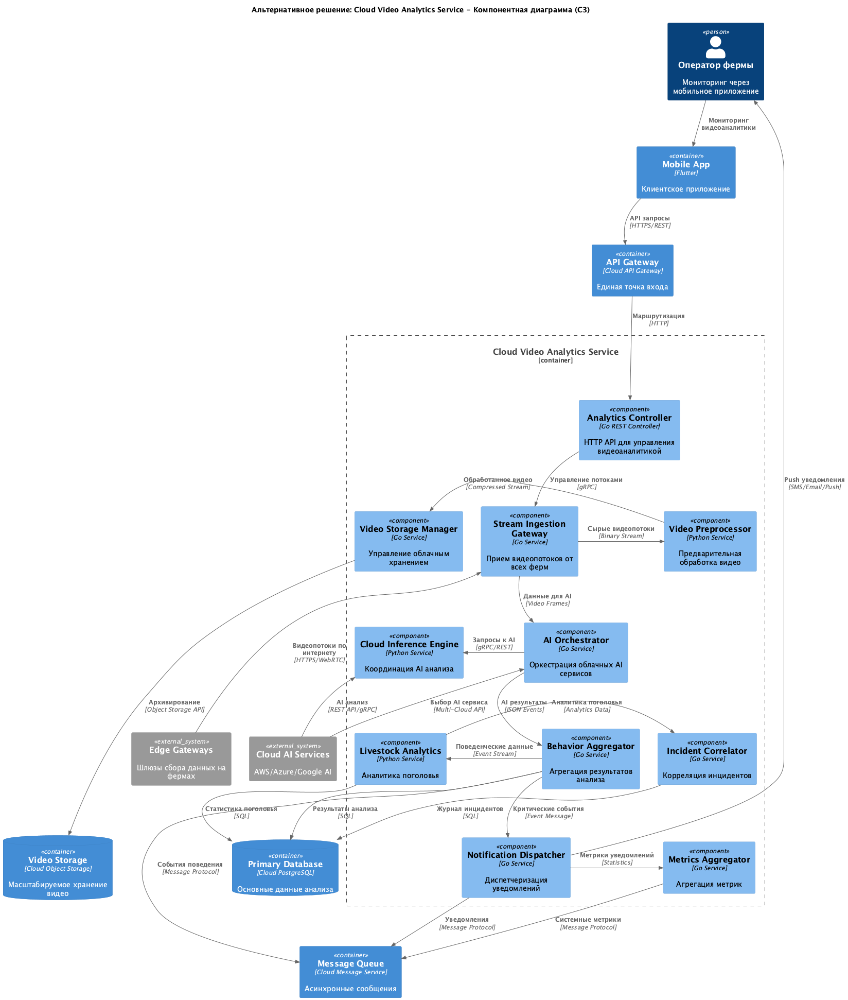
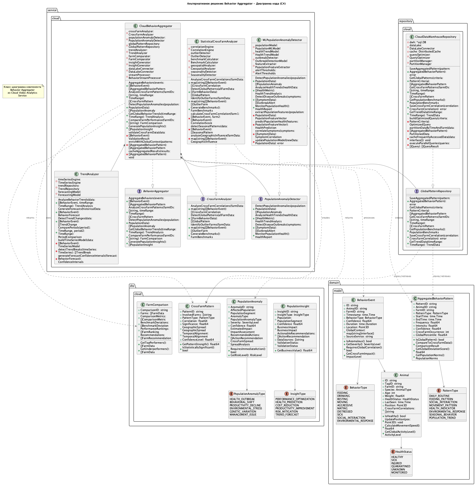

# Task3 — C3/C4 диаграммы

Ниже встроены ключевые диаграммы уровня компонентов (C3) и кода (C4).

## Основное решение (edge/hybrid)

Исходник: [solution1_component_diagram.puml](./solution1_component_diagram.puml)

Исходник: [solution1_code_diagram.puml](./solution1_code_diagram.puml)

## Альтернативное решение (cloud)

Исходник: [solution2_component_diagram.puml](./solution2_component_diagram.puml)

Исходник: [solution2_code_diagram.puml](./solution2_code_diagram.puml)
